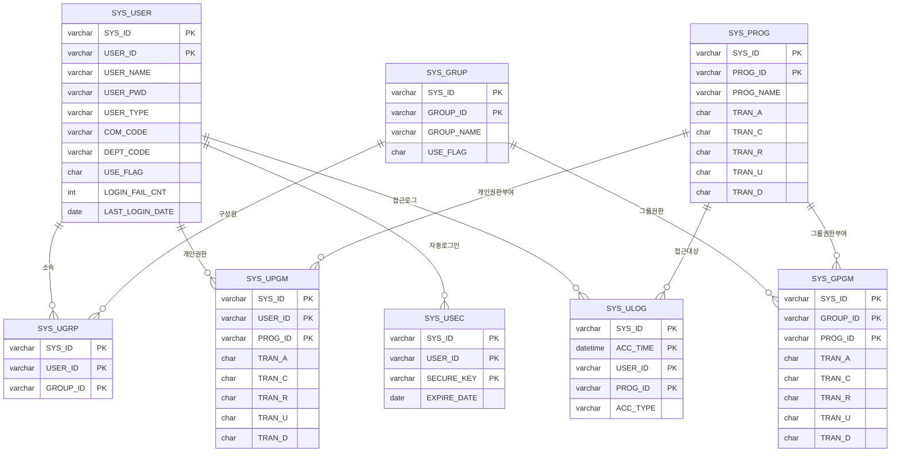
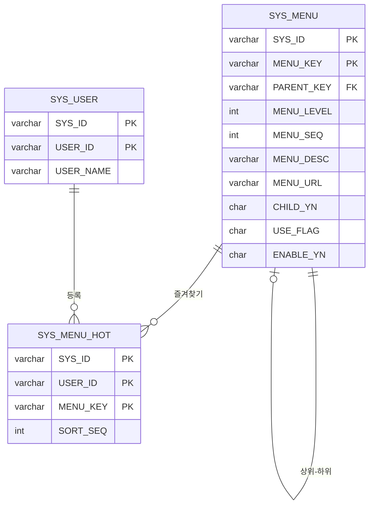
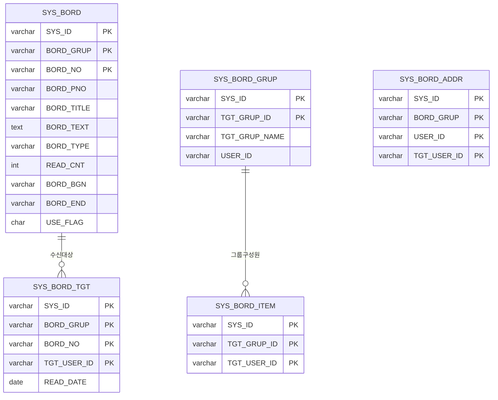
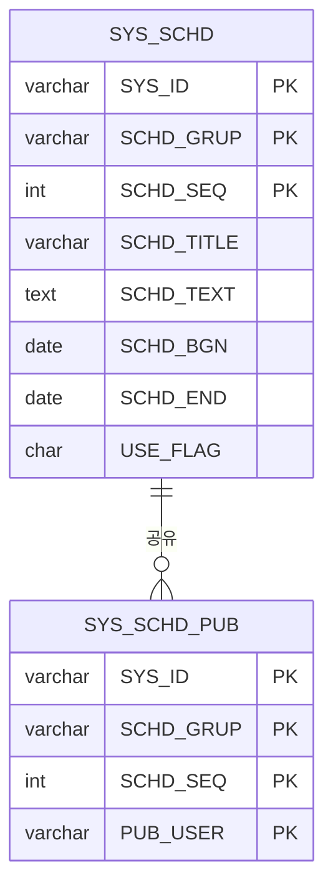
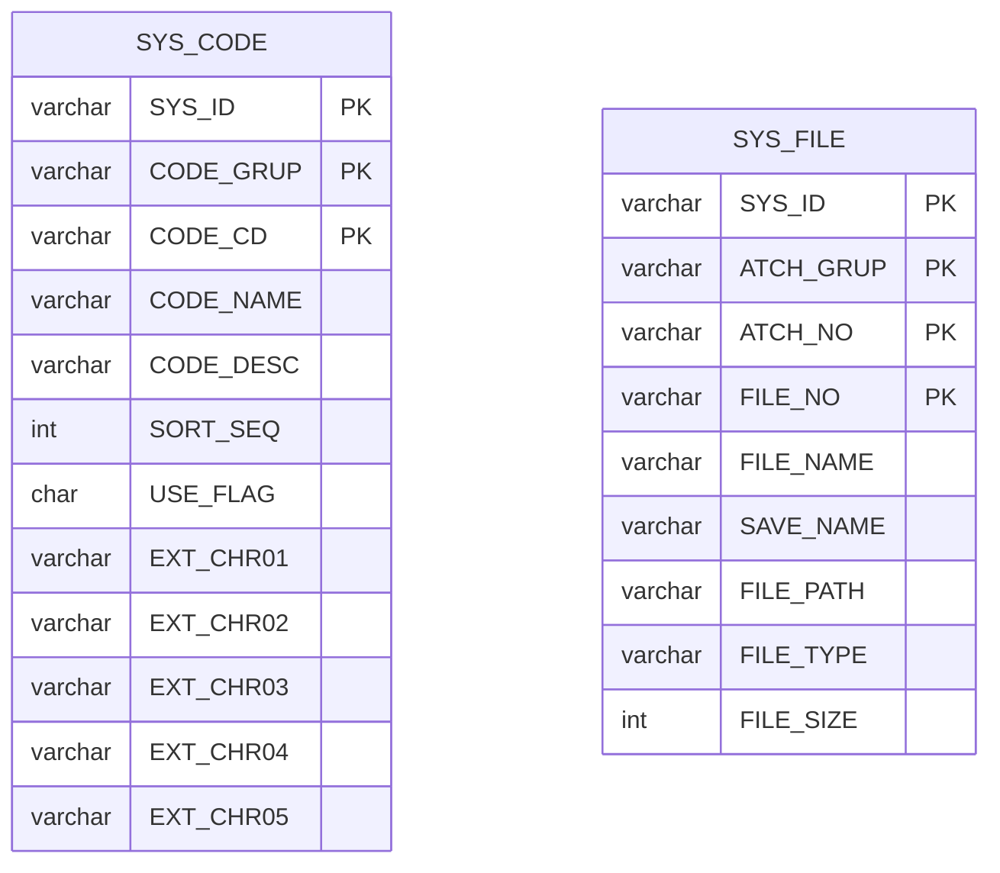

# IM_MES 데이터베이스 ERD (Entity Relationship Diagram)

> **시스템 ID**: IMMES
> **DBMS**: MySQL
> **테이블 수**: 19개 시스템 테이블

---

## 1. 전체 ERD 다이어그램

```mermaid
erDiagram
    %% ========================================
    %% 사용자/권한 관계
    %% ========================================

    SYS_USER ||--o{ SYS_UGRP : "has"
    SYS_USER ||--o{ SYS_UPGM : "has"
    SYS_USER ||--o{ SYS_USEC : "has"
    SYS_USER ||--o{ SYS_ULOG : "logs"
    SYS_USER ||--o{ SYS_MENU_HOT : "bookmarks"

    SYS_GRUP ||--o{ SYS_UGRP : "contains"
    SYS_GRUP ||--o{ SYS_GPGM : "has"

    SYS_PROG ||--o{ SYS_UPGM : "grants"
    SYS_PROG ||--o{ SYS_GPGM : "grants"
    SYS_PROG ||--o{ SYS_ULOG : "accessed"

    SYS_MENU ||--o{ SYS_MENU_HOT : "bookmarked"
    SYS_MENU ||--o| SYS_MENU : "parent-child"

    %% ========================================
    %% 게시판 관계
    %% ========================================

    SYS_BORD ||--o{ SYS_BORD_TGT : "targets"
    SYS_BORD_GRUP ||--o{ SYS_BORD_ITEM : "contains"

    %% ========================================
    %% 일정 관계
    %% ========================================

    SYS_SCHD ||--o{ SYS_SCHD_PUB : "shared"

    %% ========================================
    %% 테이블 정의
    %% ========================================

    SYS_USER {
        varchar SYS_ID PK "시스템ID"
        varchar USER_ID PK "사용자ID"
        varchar USER_NAME "사용자명"
        varchar USER_PWD "비밀번호(암호화)"
        varchar USER_TYPE "사용자유형"
        varchar COM_CODE "회사코드"
        varchar DEPT_CODE "부서코드"
        varchar USER_MAIL "이메일"
        varchar USER_HP "핸드폰"
        char USE_FLAG "사용여부"
        date LAST_LOGIN_DATE "최종로그인"
        int LOGIN_FAIL_CNT "로그인실패횟수"
    }

    SYS_GRUP {
        varchar SYS_ID PK "시스템ID"
        varchar GROUP_ID PK "그룹ID"
        varchar GROUP_NAME "그룹명"
        char USE_FLAG "사용여부"
    }

    SYS_UGRP {
        varchar SYS_ID PK "시스템ID"
        varchar USER_ID PK,FK "사용자ID"
        varchar GROUP_ID PK,FK "그룹ID"
    }

    SYS_PROG {
        varchar SYS_ID PK "시스템ID"
        varchar PROG_ID PK "화면ID(URL)"
        varchar PROG_NAME "화면명"
        char TRAN_A "기본권한"
        char TRAN_C "등록권한"
        char TRAN_R "조회권한"
        char TRAN_U "수정권한"
        char TRAN_D "삭제권한"
        char USE_FLAG "사용여부"
    }

    SYS_UPGM {
        varchar SYS_ID PK "시스템ID"
        varchar USER_ID PK,FK "사용자ID"
        varchar PROG_ID PK,FK "화면ID"
        char TRAN_A "기본권한"
        char TRAN_C "등록권한"
        char TRAN_R "조회권한"
        char TRAN_U "수정권한"
        char TRAN_D "삭제권한"
    }

    SYS_GPGM {
        varchar SYS_ID PK "시스템ID"
        varchar GROUP_ID PK,FK "그룹ID"
        varchar PROG_ID PK,FK "화면ID"
        char TRAN_A "기본권한"
        char TRAN_C "등록권한"
        char TRAN_R "조회권한"
        char TRAN_U "수정권한"
        char TRAN_D "삭제권한"
    }

    SYS_USEC {
        varchar SYS_ID PK "시스템ID"
        varchar USER_ID PK,FK "사용자ID"
        varchar SECURE_KEY PK "보안키"
        date EXPIRE_DATE "만료일"
    }

    SYS_ULOG {
        varchar SYS_ID PK "시스템ID"
        datetime ACC_TIME PK "접근시간"
        varchar USER_ID PK,FK "사용자ID"
        varchar PROG_ID PK,FK "화면ID"
        varchar ACC_TYPE "접근유형"
    }

    SYS_MENU {
        varchar SYS_ID PK "시스템ID"
        varchar MENU_KEY PK "메뉴키"
        varchar PARENT_KEY FK "상위메뉴키"
        int MENU_LEVEL "메뉴레벨"
        int MENU_SEQ "정렬순서"
        varchar MENU_DESC "메뉴명"
        varchar MENU_URL "메뉴URL"
        char CHILD_YN "하위메뉴여부"
        char USE_FLAG "사용여부"
        char ENABLE_YN "활성화여부"
    }

    SYS_MENU_HOT {
        varchar SYS_ID PK "시스템ID"
        varchar USER_ID PK,FK "사용자ID"
        varchar MENU_KEY PK,FK "메뉴키"
        int SORT_SEQ "정렬순서"
    }

    SYS_CODE {
        varchar SYS_ID PK "시스템ID"
        varchar CODE_GRUP PK "코드그룹"
        varchar CODE_CD PK "코드값"
        varchar CODE_NAME "코드명"
        int SORT_SEQ "정렬순서"
        char USE_FLAG "사용여부"
        varchar EXT_CHR01 "확장속성1"
        varchar EXT_CHR02 "확장속성2"
    }

    SYS_FILE {
        varchar SYS_ID PK "시스템ID"
        varchar ATCH_GRUP PK "첨부구분"
        varchar ATCH_NO PK "첨부번호"
        varchar FILE_NO PK "파일번호"
        varchar FILE_NAME "원본파일명"
        varchar SAVE_NAME "저장파일명"
        varchar FILE_PATH "파일경로"
        varchar FILE_TYPE "파일타입"
        int FILE_SIZE "파일크기"
    }

    SYS_BORD {
        varchar SYS_ID PK "시스템ID"
        varchar BORD_GRUP PK "게시판구분"
        varchar BORD_NO PK "게시물번호"
        varchar BORD_PNO "상위게시물(답글)"
        varchar BORD_TITLE "제목"
        text BORD_TEXT "내용"
        varchar BORD_TYPE "게시유형"
        int READ_CNT "조회수"
        varchar BORD_BGN "게시시작일"
        varchar BORD_END "게시종료일"
        char USE_FLAG "사용여부"
    }

    SYS_BORD_TGT {
        varchar SYS_ID PK "시스템ID"
        varchar BORD_GRUP PK,FK "게시판구분"
        varchar BORD_NO PK,FK "게시물번호"
        varchar TGT_USER_ID PK "대상사용자ID"
        date READ_DATE "확인일시"
    }

    SYS_BORD_ADDR {
        varchar SYS_ID PK "시스템ID"
        varchar BORD_GRUP PK "게시판구분"
        varchar USER_ID PK "사용자ID"
        varchar TGT_USER_ID PK "대상사용자ID"
    }

    SYS_BORD_GRUP {
        varchar SYS_ID PK "시스템ID"
        varchar TGT_GRUP_ID PK "주소록그룹ID"
        varchar TGT_GRUP_NAME "그룹명"
        varchar USER_ID "소유자ID"
    }

    SYS_BORD_ITEM {
        varchar SYS_ID PK "시스템ID"
        varchar TGT_GRUP_ID PK,FK "주소록그룹ID"
        varchar TGT_USER_ID PK "대상사용자ID"
    }

    SYS_SCHD {
        varchar SYS_ID PK "시스템ID"
        varchar SCHD_GRUP PK "일정구분"
        int SCHD_SEQ PK "일정순번"
        varchar SCHD_TITLE "일정제목"
        text SCHD_TEXT "일정내용"
        date SCHD_BGN "시작일"
        date SCHD_END "종료일"
        char USE_FLAG "사용여부"
    }

    SYS_SCHD_PUB {
        varchar SYS_ID PK "시스템ID"
        varchar SCHD_GRUP PK,FK "일정구분"
        int SCHD_SEQ PK,FK "일정순번"
        varchar PUB_USER PK "공유대상ID"
    }
```



---

## 2. 도메인별 ERD

### 2.1 사용자/권한 관리 ERD



### 2.2 메뉴 관리 ERD



### 2.3 게시판 ERD



### 2.4 일정 관리 ERD



### 2.5 코드/파일 관리 ERD



---

## 3. 테이블 관계도 (텍스트 형식)

### 3.1 권한 체계 관계

```
┌─────────────────────────────────────────────────────────────────────┐
│                          권한 체계 ERD                               │
└─────────────────────────────────────────────────────────────────────┘

                         ┌───────────────┐
                         │   SYS_USER    │
                         │  (사용자정보)  │
                         └───────┬───────┘
                                 │
          ┌──────────────────────┼──────────────────────┐
          │                      │                      │
          ▼                      ▼                      ▼
   ┌─────────────┐       ┌─────────────┐       ┌─────────────┐
   │  SYS_UGRP   │       │  SYS_UPGM   │       │  SYS_USEC   │
   │ (사용자그룹) │       │(개인화면권한)│       │(자동로그인) │
   └──────┬──────┘       └──────┬──────┘       └─────────────┘
          │                     │
          ▼                     │
   ┌─────────────┐              │
   │  SYS_GRUP   │              │
   │  (그룹정보)  │              │
   └──────┬──────┘              │
          │                     │
          ▼                     ▼
   ┌─────────────┐       ┌─────────────┐
   │  SYS_GPGM   │◄──────│  SYS_PROG   │
   │(그룹화면권한)│       │  (화면정보)  │
   └─────────────┘       └─────────────┘
```

### 3.2 권한 결정 흐름

```
┌─────────────────────────────────────────────────────────────────────┐
│                      권한 결정 우선순위                              │
└─────────────────────────────────────────────────────────────────────┘

   ┌────────────────────────────────────────────────────────────────┐
   │  사용자가 화면에 접근 시 권한 확인 순서                          │
   │                                                                │
   │  1순위: SYS_UPGM (개인 권한)                                    │
   │         └─ 사용자별로 직접 부여된 권한                          │
   │                                                                │
   │  2순위: SYS_GPGM + SYS_UGRP (그룹 권한)                        │
   │         └─ 사용자가 속한 그룹의 권한 (MAX 함수로 병합)          │
   │                                                                │
   │  3순위: SYS_PROG (기본 권한)                                    │
   │         └─ 화면에 설정된 기본 권한 (TRAN_A)                     │
   └────────────────────────────────────────────────────────────────┘

   결과: V_SYS_AUTH 뷰로 통합 조회
```

### 3.3 메뉴 계층 구조

```
┌─────────────────────────────────────────────────────────────────────┐
│                        메뉴 계층 구조                                │
└─────────────────────────────────────────────────────────────────────┘

   SYS_MENU (Self-Join: PARENT_KEY → MENU_KEY)

   ├─ MENU_KEY: 90000 (시스템관리) ─ MENU_LEVEL: 1
   │  │
   │  ├─ MENU_KEY: 91000 (코드관리) ─ MENU_LEVEL: 2
   │  │  └─ MENU_URL: /common/code/code.do
   │  │
   │  ├─ MENU_KEY: 92000 (사용자관리) ─ MENU_LEVEL: 2
   │  │  └─ MENU_URL: /common/user/user.do
   │  │
   │  └─ MENU_KEY: 93000 (그룹관리) ─ MENU_LEVEL: 2
   │     └─ MENU_URL: /common/user/group.do
   │
   └─ MENU_KEY: 80000 (업무관리) ─ MENU_LEVEL: 1
      │
      ├─ MENU_KEY: 81000 (거래처관리) ─ MENU_LEVEL: 2
      │
      └─ MENU_KEY: 82000 (직원관리) ─ MENU_LEVEL: 2
```

### 3.4 게시판 데이터 흐름

```
┌─────────────────────────────────────────────────────────────────────┐
│                      게시판 데이터 흐름                              │
└─────────────────────────────────────────────────────────────────────┘

   1. 게시물 작성
   ┌───────────────┐
   │   SYS_BORD    │ ◄─── 게시물 등록
   │  (게시물)      │
   └───────┬───────┘
           │
           ▼
   2. 수신자 지정
   ┌───────────────┐      ┌───────────────┐
   │ SYS_BORD_GRUP │─────▶│ SYS_BORD_ITEM │
   │ (주소록 그룹)  │      │ (그룹 구성원)  │
   └───────────────┘      └───────┬───────┘
                                  │
                                  ▼
   3. 발송 대상 생성
   ┌───────────────┐
   │ SYS_BORD_TGT  │ ◄─── 수신자별 레코드 생성
   │ (게시 대상)    │
   └───────┬───────┘
           │
           ▼
   4. 확인 처리
   READ_DATE 업데이트 (확인 시)
```

---

## 4. Foreign Key 관계 상세

### 4.1 사용자 관련 FK

| 자식 테이블 | FK 컬럼 | 부모 테이블 | PK 컬럼 |
|------------|---------|------------|---------|
| SYS_UGRP | SYS_ID, USER_ID | SYS_USER | SYS_ID, USER_ID |
| SYS_UGRP | SYS_ID, GROUP_ID | SYS_GRUP | SYS_ID, GROUP_ID |
| SYS_UPGM | SYS_ID, USER_ID | SYS_USER | SYS_ID, USER_ID |
| SYS_UPGM | SYS_ID, PROG_ID | SYS_PROG | SYS_ID, PROG_ID |
| SYS_USEC | SYS_ID, USER_ID | SYS_USER | SYS_ID, USER_ID |
| SYS_ULOG | SYS_ID, USER_ID | SYS_USER | SYS_ID, USER_ID |
| SYS_ULOG | SYS_ID, PROG_ID | SYS_PROG | SYS_ID, PROG_ID |

### 4.2 그룹 관련 FK

| 자식 테이블 | FK 컬럼 | 부모 테이블 | PK 컬럼 |
|------------|---------|------------|---------|
| SYS_GPGM | SYS_ID, GROUP_ID | SYS_GRUP | SYS_ID, GROUP_ID |
| SYS_GPGM | SYS_ID, PROG_ID | SYS_PROG | SYS_ID, PROG_ID |

### 4.3 메뉴 관련 FK

| 자식 테이블 | FK 컬럼 | 부모 테이블 | PK 컬럼 |
|------------|---------|------------|---------|
| SYS_MENU | SYS_ID, PARENT_KEY | SYS_MENU | SYS_ID, MENU_KEY |
| SYS_MENU_HOT | SYS_ID, USER_ID | SYS_USER | SYS_ID, USER_ID |
| SYS_MENU_HOT | SYS_ID, MENU_KEY | SYS_MENU | SYS_ID, MENU_KEY |

### 4.4 게시판 관련 FK

| 자식 테이블 | FK 컬럼 | 부모 테이블 | PK 컬럼 |
|------------|---------|------------|---------|
| SYS_BORD_TGT | SYS_ID, BORD_GRUP, BORD_NO | SYS_BORD | SYS_ID, BORD_GRUP, BORD_NO |
| SYS_BORD_ITEM | SYS_ID, TGT_GRUP_ID | SYS_BORD_GRUP | SYS_ID, TGT_GRUP_ID |

### 4.5 일정 관련 FK

| 자식 테이블 | FK 컬럼 | 부모 테이블 | PK 컬럼 |
|------------|---------|------------|---------|
| SYS_SCHD_PUB | SYS_ID, SCHD_GRUP, SCHD_SEQ | SYS_SCHD | SYS_ID, SCHD_GRUP, SCHD_SEQ |

---

## 5. 테이블 분류 요약

### 5.1 계층별 분류

```
┌─────────────────────────────────────────────────────────────────────┐
│                      테이블 계층 구조                                │
└─────────────────────────────────────────────────────────────────────┘

Level 1 - 핵심 마스터 (5개)
├─ SYS_USER   : 사용자 정보 (최상위)
├─ SYS_GRUP   : 그룹 정보
├─ SYS_PROG   : 화면 정보
├─ SYS_CODE   : 코드 마스터
└─ SYS_MENU   : 메뉴 정보

Level 2 - 관계/권한 (4개)
├─ SYS_UGRP   : 사용자-그룹 매핑
├─ SYS_UPGM   : 사용자-화면 권한
├─ SYS_GPGM   : 그룹-화면 권한
└─ SYS_MENU_HOT : 사용자-메뉴 즐겨찾기

Level 3 - 비즈니스 (6개)
├─ SYS_BORD      : 게시판 마스터
├─ SYS_BORD_TGT  : 게시 대상
├─ SYS_BORD_ADDR : 개인 주소록
├─ SYS_BORD_GRUP : 주소록 그룹
├─ SYS_BORD_ITEM : 그룹 구성원
└─ SYS_FILE      : 첨부파일

Level 4 - 일정/로그 (4개)
├─ SYS_SCHD     : 일정 마스터
├─ SYS_SCHD_PUB : 일정 공유
├─ SYS_ULOG     : 사용 로그
└─ SYS_USEC     : 자동로그인
```

### 5.2 도메인별 테이블 수

| 도메인 | 테이블 수 | 테이블 목록 |
|--------|----------|-------------|
| 권한/인증 | 5개 | USER, USEC, UGRP, UPGM, ULOG |
| 그룹 | 2개 | GRUP, GPGM |
| 메뉴/화면 | 3개 | PROG, MENU, MENU_HOT |
| 코드 | 1개 | CODE |
| 파일 | 1개 | FILE |
| 게시판 | 5개 | BORD, BORD_TGT, BORD_ADDR, BORD_GRUP, BORD_ITEM |
| 일정 | 2개 | SCHD, SCHD_PUB |
| **합계** | **19개** | |

---

## 6. 공통 컬럼 패턴

### 6.1 모든 테이블 공통

```sql
-- PK 첫 번째 컬럼 (멀티테넌시)
SYS_ID      VARCHAR(20)   NOT NULL  -- 시스템ID (IMMES)

-- 감사 추적 (Audit Trail)
REGI_ID     VARCHAR(20)             -- 등록자 ID
REGI_DATE   DATE                    -- 등록 일시
CHNG_ID     VARCHAR(20)             -- 수정자 ID
CHNG_DATE   DATE                    -- 수정 일시
```

### 6.2 상태 관리 테이블

```sql
-- 논리적 삭제용 (대부분의 마스터 테이블)
USE_FLAG    CHAR(1)       DEFAULT 'Y'  -- 사용여부 (Y/N)
```

### 6.3 권한 테이블 공통 (PROG, UPGM, GPGM)

```sql
-- 권한 플래그 (13개)
TRAN_A      CHAR(1)   -- 기본 권한 (All)
TRAN_C      CHAR(1)   -- 등록 권한 (Create)
TRAN_R      CHAR(1)   -- 조회 권한 (Read)
TRAN_U      CHAR(1)   -- 수정 권한 (Update)
TRAN_D      CHAR(1)   -- 삭제 권한 (Delete)
TRAN_P      CHAR(1)   -- 권한 P (커스텀)
TRAN_S      CHAR(1)   -- 권한 S (커스텀)
TRAN_1      CHAR(1)   -- 커스텀 권한 1
TRAN_2      CHAR(1)   -- 커스텀 권한 2
TRAN_3      CHAR(1)   -- 커스텀 권한 3
TRAN_4      CHAR(1)   -- 커스텀 권한 4
TRAN_5      CHAR(1)   -- 커스텀 권한 5
```

---

## 7. 주요 코드 그룹 (SYS_CODE)

| CODE_GRUP | 설명 | 예시 코드값 |
|-----------|------|------------|
| USE_FLAG | 사용 여부 | Y(사용), N(미사용) |
| USER_TYPE | 사용자 유형 | A(관리자), C(일반) |
| BORD_GRUP | 게시판 종류 | B01(공지사항), B02(공지), B03(자료), B04(Q&A) |
| DEPT_CODE | 부서 코드 | (업무별 정의) |

---

## 문서 정보

| 항목 | 값 |
|------|-----|
| **문서 버전** | 1.0 |
| **생성일** | 2026-01-12 |
| **시스템 ID** | IMMES |
| **테이블 수** | 19개 |
